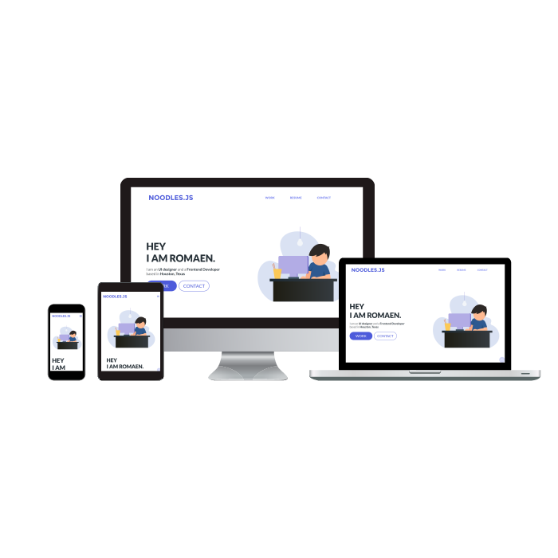

# Personal Portfolio

Personal portfolio to showcase my works

Link to website: https://noodlesjs.dev

My name is Romaen but I also go by Noodles hence "Noodlesjs" :)

## Technology used
This application is built from scratch using html, css and vanilla js.

## Responsive
This application is fully responsive. I enjoyed making my own css structure so the application would be adjusted to any viewport and adapt to new content I add.
Below are some screenshots of the final product.

## Contact Me
If you would like to get in touch, please leave a message through github or email me at romaenwritescode@gmail.com